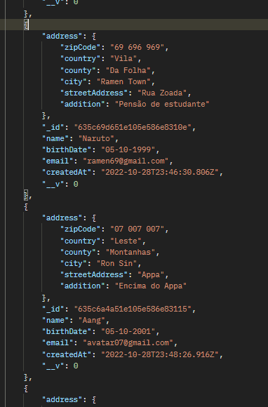
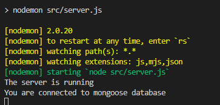

# **Backend - Registration System/Login** 

## **Description**
Back-end application to register patients

## **API Heroku Cloud Deploy**
[https://my-register-backend.herokuapp.com](https://my-register-backend.herokuapp.com)

## **Objectives**
To develop a Back end application with a `Client` model providing an interface to interact with the "Client" collection in the database. It allows performing CRUD (Create, Read, Update, Delete) operations on the collection.  

## **Technologies**

This back end part of the project is developed with the following technologies: 
- NodeJs
  - Express Server web application library. 
  - MongoDb - Mongoose 
      In this project the model schema for the "Client" object uses Mongoose, which is an Object Data Modeling (ODM) library for MongoDB in Node.js.   
- JSON
- dotenv
  You must use your own username (DB_USER) and password (DB_PASS) and create a '.env' file in the backend root for MongoDb (Atlas) in order to run locally.
- Server deploy at Render or Heroku 
- MongoDB Cloud Atlas

  
## **Requirements**
- Node.js;
- Heroku account 
- MongoDB Atlas Account
- npm or yarn;
- Frontend repository: [https://github.com/malanski/development-challenge-four/tree/main/frontend/](https://github.com/malanski/development-challenge-four/tree/main/frontend)

## **Installations**
`npm install`
   

## **endPoints**

- POST: /patients
 - Create patient
    
- GET: /patients
 - Read all patients.
    
- GET: /patients/:id
 - Read (search) patient by id.
     
- PATCH: /patients/:id
 - Update patient data by id.
  
- DELETE: /patients/:id
 - Delete patient by id.
   
## **Project Clone**
HTTPS  
`git clone https://github.com/malanski/development-challenge-four.git`
  
SSH  
`git clone git@github.com:malanski/development-challenge-four.git`
# 📷 App Demonstrations

  
Use Nodemon for Development:  

  
## **About the author and acknowledgment**
I Ulisses Malanski as project developer am grateful for being able to participate in this challenge, because it was a great opportunity to develop my hard skills, improving my knowledge in building web applications.

