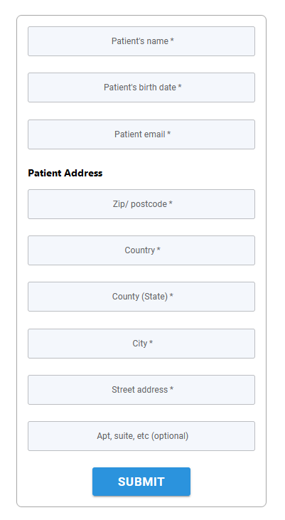
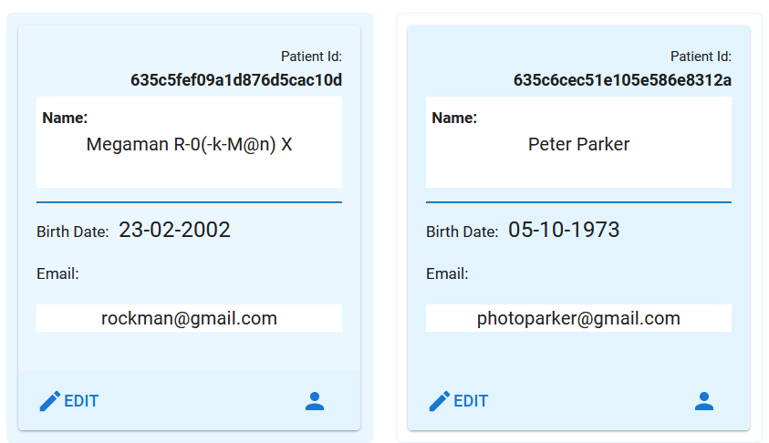
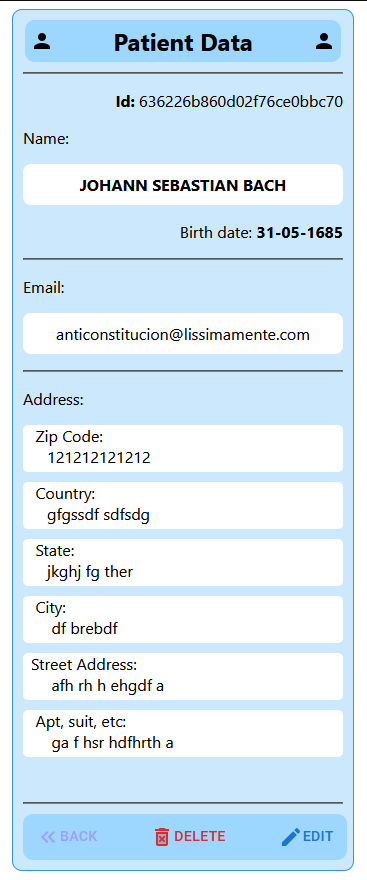
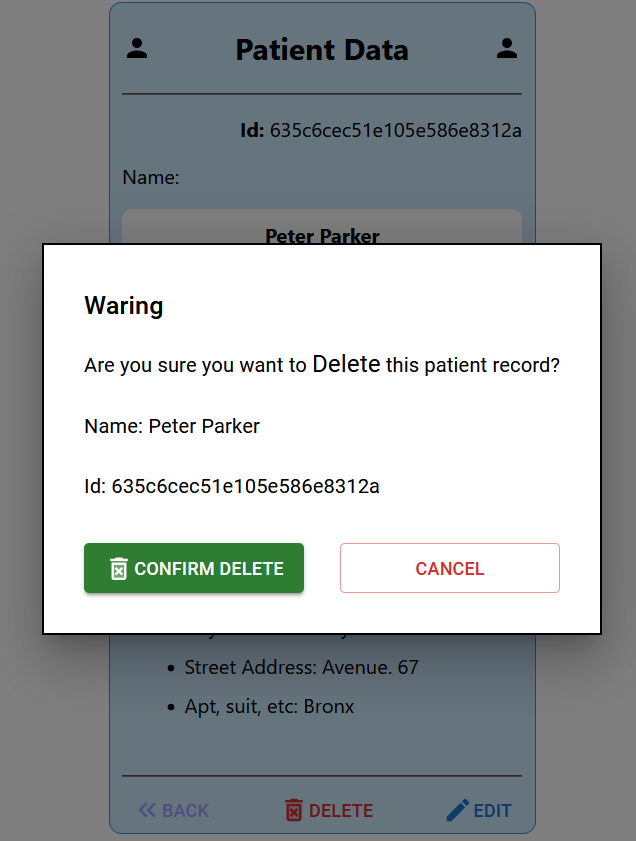

# **Frontend - Registration System/Login** 

## **Description**
Front-end application for visual interaction with the patients registration Api

  
## **Access Application**
[https://development-challenge-four-eta.vercel.app/](https://development-challenge-four-eta.vercel.app/)

## **Objectives**
- Create application with ReactJs using Yup, Material-UI and useForm
- Error handling and validations  

## **Technologies**

This project was developed with the following technologies: 
- JavaScript 
- ReactJs 
- React Router 
- React useForm 
- Material-UI 
- Yup 
- Axios
- Vercel

## **Requirements**
- Node.js;
- npm or yarn;
- Backend repository: [https://github.com/malanski/development-challenge-four/tree/main/backend/](https://github.com/malanski/development-challenge-four/tree/main/backend)
- Backend Deploy: [https://my-register-backend.herokuapp.com](https://my-register-backend.herokuapp.com)

## **Installations**
`npm install`

## **Project Clone**
HTTPS  
`git clone https://github.com/malanski/development-challenge-four.git`
  
SSH  
`git clone git@github.com:malanski/development-challenge-four.git`
# 📷 App Demonstrations
Create patient Form

  
Fetch all patients data from Patient Api  

  
Fetch data from Patient Api   
  
  
Fetch data from Patient Api   

## **About the author and acknowledgment**
I Ulisses Malanski as project developer am grateful for being able to participate in this challenge, because it was a great opportunity to develop my hard skills, improving my knowledge in building web applications.

